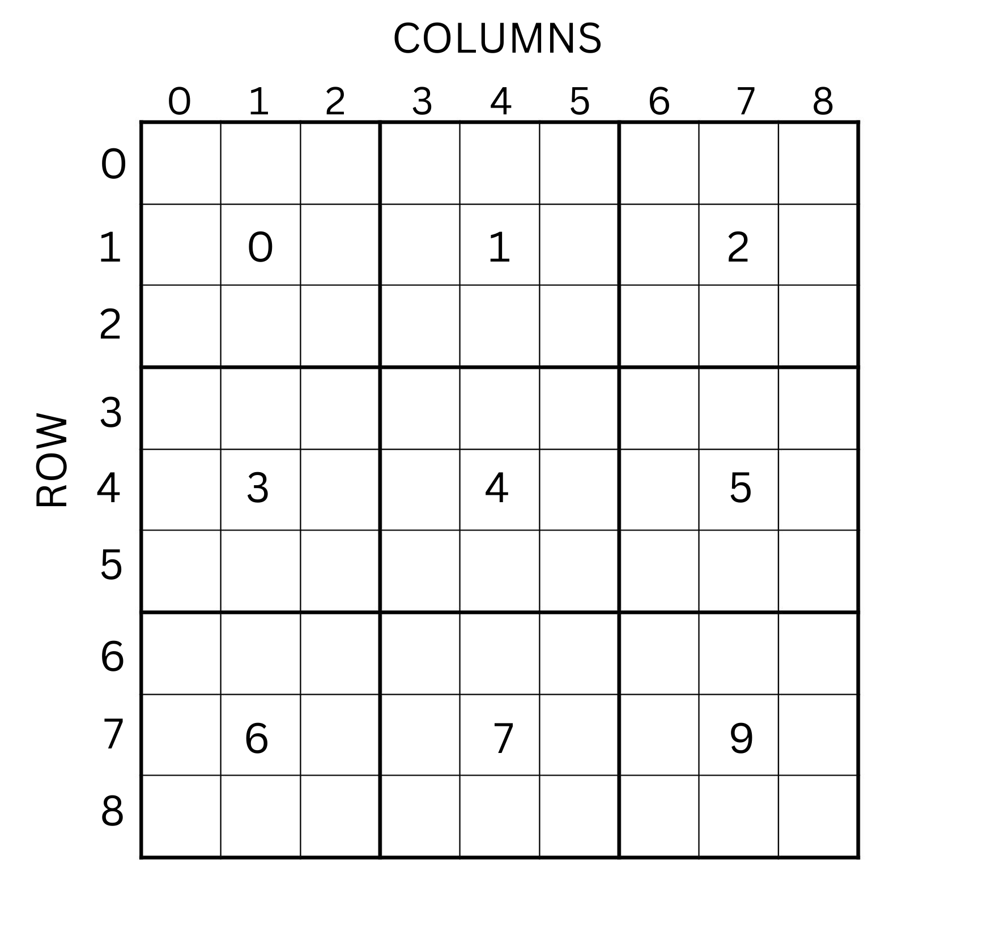

# Homework 2 - Debugging with Alex

**Authors**
- Nicolae-Cristian Macovei
- Teodor Andrei Vica
- George Cosma
- Rareș Constantin

---

### DEADLINE SOFT: 04.05.2025
### DEADLINE HARD: 09.05.2025

---

#### ALEX IS BACK!
Following the first task, Alex — our modern TikTok brainrot specialist — has returned with new challenges for you. In his mission to escape Instagram’s endless scroll, he has begun implementing a much more powerful algorithm that will revolutionize the world. In building this top-secret algorithm, Alex is looking for help with implementing certain parts he can’t handle right now.

<div align="center">
    
</div>

**Alex advises you to complete the assignment on the PCLP2 / IOCLA virtual machine.**
**If you're working on a different system (WSL, native Linux), he advises you to also test your solution on the PCLP2 VM.**

---
## Task 1 - Numbers (15p)
<br>

To be able to implement the revolutionary algorithm, Alex needs to get rid of certain numbers that could stand in his way. Therefore, we divide task 1 into two parts/subtasks as follows:

### Subtask 1 - Odd numbers

Posts with odd IDs are considered brainrot, so in this subtask, you need to remove the odd numbers from a list of numbers provided as a parameter. The numbers in the list represent the IDs of certain Instagram posts.

### Subtask 2 - Power-numbers

Once the odd numbers have been removed, Alex asks us to also eliminate the numbers in the list that are powers of 2. As a result, the posts with those IDs will disappear after removing the numbers from the list, making it easier for Alex to implement his algorithm.

<br>
It is important to note that your implementation should not modify the original list, but instead store the numbers that meet the conditions of the two subtasks in a separate list. Additionally, the subtasks are not independent. They serve merely as a formal way to divide task 1 into two parts, but essentially they form a single function. Implementing subtask 1 without subtask 2 will result in receiving only half of the total points for the task.

<br>
The function that Alex needs to implement has the following header:

```c
void remove_numbers(int *a, int n, int *target, int *ptr_len);
```

**The first argument** (`a`) is a list of 32-bit numbers.

**The second argument** (`n`) represents the number of elements in the original list.

**The third argument** (`target`) represents the memory address where the function should write the result after removing the unwanted numbers. Thus, after completing the two subtasks, `target` will contain the new list with only the numbers accepted by Alex.

**The fourth argument** (`ptr_len`) represents the memory address where the function must write the number of elements in the newly created list.

The function must be completed in the `remove_numbers.asm` file.

<br>

## Task 2 - Events (30p)
<br>

To manage his events without using Instagram, Alex decided to automate the
generation of event dates, but unfortunately he is not the ultimate engineer
yet, so some of the events are invalid. Help him check which events are invalid
and sort them by different attributes.

There are two structures used for this task, which are both packed:

```c
    struct date {
        uint8_t day;
        uint8_t month;
        uint16_t year;
    };

    struct event {
        char name[31];
        uint8_t valid;
        struct date date;
    };
```

### Subtask 1

For this subtask, you have to check if the date of each event is valid, based
on the next rules:

- The year should be between 1990 and 2030
- The month should be between 1 and 12
- The day should be between 1 and the last day of each month (e.g. for January the last day is 31, for February, it is 28)

If a date is valid, set the `valid` flag in the `event` structure to 1 (True), to 0 (False) otherwise.

The function definition is:

```c
void check_events(struct event *events, int len);
```

The arguments are:

- **events:** start address of the events array
- **len:** number of events in the array

### Subtask 2

For this subtask, you have to sort the events resulted after the first subtask
following the next steps while comparing two events:

- if an event is valid, it is **not** considered greater, which means all the valid events should come first
- if two events are valid, they should be sorted by their date, by year, then by month, then by date
- if the dates of two events are equal, they should be sorted like using `strcmp()` function by their name and using its result, so if the result is negative, it means the first name should come first in the sorted array

The sorting should be done **in place**, that means that the array given as input should contain the sorted
events and that is what will be checked.

The function definition is:

```c
void sort_events(struct event *events, int len);
```

The arguments are:

- **events:** start address of the events array
- **len:** number of events in the array

**All the data in the structures will be limited to their data type size and the name of the events is unique!**

#### **Important Notice**

For the second subtask will be used the same array given as input in the first subtask, this means that any wrong modifications of the structures during the first subtask will affect the second task and it will result in a failed test. The second subtask can not be completed without completing the first subtask.

<br>


## Task 3 - Base64 (25p)
<br>

After days and days of trying, Alex realizes there's still one more obstacle to overcome before completing the algorithm. During development, he notices that certain byte strings can be easily corrupted, so he wants to eliminate any risk by ensuring that all information is transmitted in an encrypted form. For this encryption, he chooses a well-known algorithm that is both simple to use and efficient. After much research, he decides on the Base64 encoding algorithm. Below, we’ll briefly describe the algorithm for a better understanding of the task.


#### Base64 algorithm :
First, we will "split" the string to be transformed into groups of 3 bytes, since the following algorithm operates on 3-byte groups.
<br>
Let's assume we have the following 3-byte array:
<br>
```bash
    [0x4D, 0x61, 0x6E] => ASCII : Man
```
To start, we convert each byte into binary, resulting in the following array:
<br>
```bash
    [01001101, 01100001, 01101110]
```
<br>
We will concatenate the 3 elements of the array, and then we will get a 24-bit grouping that we will divide into 4 subgroups of 6 bits. This gives the following grouping: 
<br>

```bash
    010011 010110 000101 101110
```
<br>

Once we have the 4 groups, we convert each group to decimal :
<br>

```bash
    19, 22, 5, 46
```
<br>

At this point, we need to look at the Base64 table which will tell us which character we transform each number into. This leads to the following conclusion: 
<br>
```bash
    19  -> T  
    22  -> W  
    5  -> F  
    46  -> u
```
<br>

So the result of Base64 encoding is the string `TWFu`.
<br>

You will have to implement the Base64 encoding algorithm for an array that is sent to you as a parameter, the function you have to implement has the following header:
<br>
```c
    void base64(char *a, int n, char *target, int *ptr_len);
```
<br>

-> **The first argument** is the string on which to apply the encoding algorithm
<br>

-> **The second argument** is the length of the initial string
<br>

-> **The third argument** is the memory address where you will put the new encoded string
<br>

-> **The last argument** represents the memory address where we will store the length of the new encrypted string.
<br>

The function must be completed in the `base64.asm` file.

> Useful link for Base64 Table and for a better understanding of the algorithm : <br>
> https://en.m.wikipedia.org/wiki/Base64

> **Other details** <br>
> It is important to note that we will only have to encode arrays with a number of bytes that is a multiple of 3, in order to remove edge-cases.

<br>

## Task 4 - Sudoku (20p)


### The Story

After all that hard work, Alex decided to take a break and play his favourite game: Sudoku.
What he would usually do is check out [his favourite sudoku youtuber](https://www.youtube.com/channel/UCC-UOdK8-mIjxBQm_ot1T-Q) and choose a sudoku from there, but today he wanted to take a break from all the technology and go old-school: Pen and Paper.
There is one problem though: he wants to be 100% sure he didn't make any mistakes.
Help him out by making a small checker that tells him which rows, columns, or boxes are wrong (if any).

### The Task

First, let's recap the rules of sudoku:
- In each row, the digits 1-9 must appear exactly once
- In each column, the digits 1-9 must appear exactly once
- In each box, the digits 1-9 must appear exactly once
- Rows are numbered 0 to 8 from top to bottom.
- Columns are numbered 0 to 8 lef to right.
- Boxes are numbered 0 to 8 from the top-left, and continuing left to right, wrapping around when hitting the right edge of the board (see image).

<!--  -->
<div align="center">
    
</div>

Your task is to implement three functions in assembly:
- `int check_row(char* sudoku, int row)`
- `int check_column(char* sudoku, int column)`
- `int check_box(char* sudoku, int box)`

The sudoku board is given as an 81-long char array, and the other three arguments represent which row, column, or box to check as an integer between 0 and 8.
The sudoku board may contain numbers which are not the digits 1-9.

The functions all have a return value: an `int`.
What this means in practice is that by the end of the function, a value must be left in the `eax` register.
For the purposes of this homework, the value `1` left in the `eax` register will mean that the checked row/column/box is CORRECT.
If the value left is `2` it means that it is WRONG.
All other values are ignored.

The checker will call these 3 functions and will put your result inside an output file.
The first line in the output/ref file is the `check_row` results with `row` going from 0 to 8 in that order.
The second line are the results of `check_column` and the third of `check_box`.

**Solutions which return hard-coded values that only aim to get partial points and don't try to solve the task at all (such as always returning 1) will not be given any points. You must at the very least TRY to solve this properly.**

> *Hint:* You can solve this using [Simon's](https://www.youtube.com/channel/UCC-UOdK8-mIjxBQm_ot1T-Q) sudoku secret he only tells his favourite people. This will only make solving this marginally easier, so if you don't know it already it might not be worth the effort to try and find out.

---

## Coding Style & README (10p)

To be able to use your solutions in the implementation of the secret algorithm, Alex needs well-structured and readable assembly code that follows a few good practice rules:

- writing readable code
- consistent indentation (the recommendation is to place labels at the beginning of the line and indent instructions with one tab)
- using meaningful names for labels
- including **relevant and necessary** comments in the code
- writing code lines (or README) with a maximum of 80–100 characters

You will also need to include a brief explanation of the solution for each task in a README file.

**The score for coding style and README is not included in the checker and will be awarded during evaluation.**

---

## Checker

To use the checker `local_checker.py`:
<br>
-> you need to have Python3 installed
<br>
-> you need to be in `./src`.


To view the list of possible script arguments:

```bash
    python3 local_checker.py --help
```

To run all tests:

```bash
    python3 local_checker.py --all
```
To create the archive that you need to upload on Moodle (**does not include the README; you must manually add this file to the final archive**):

```bash
    python3 local_checker.py --zip
```

During a normal run, the checker will not keep your outputs—it will perform a clean.
To keep the outputs, add the `--no_clean` argument when running the checker.

---

**Alex thanks you for your help and looks forward to seeing you for Assignment 3 as well !!!**

<div align="center">
    
</div>
