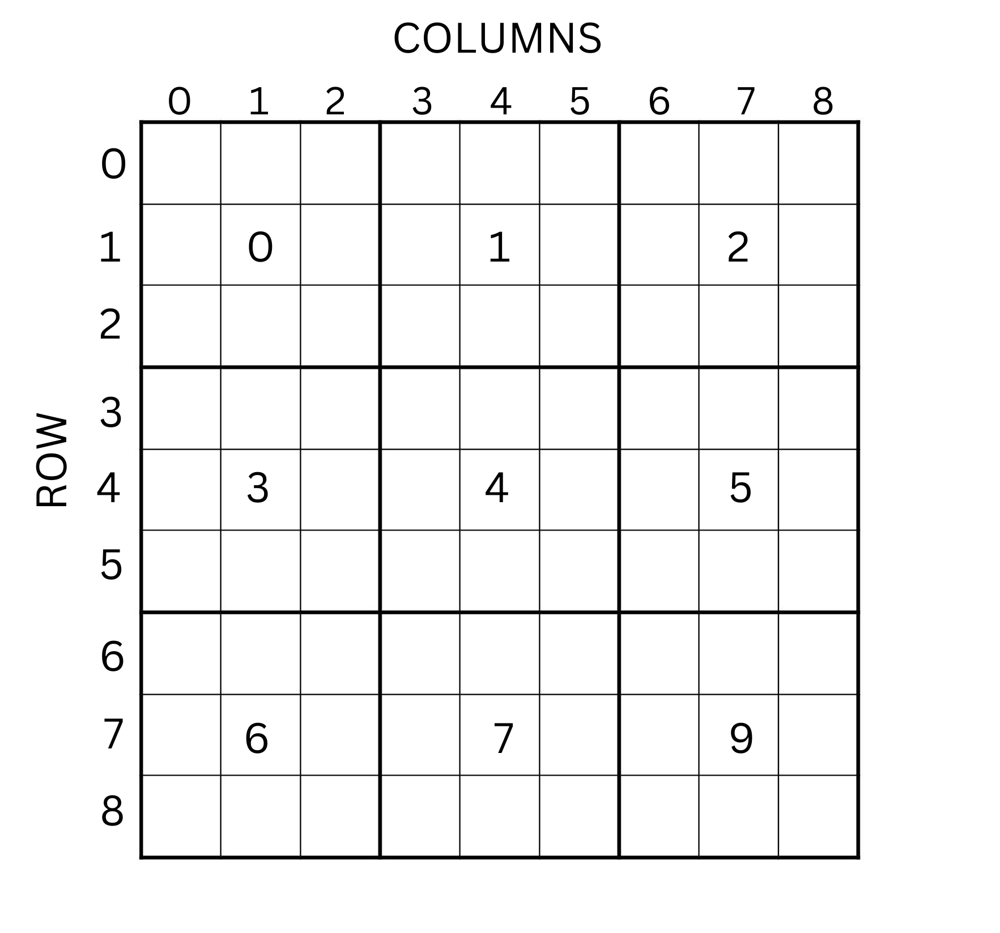

## Task 4 - Sudoku (20p)

### The Story

After all that hard work, Alex decided to take a break and play his favourite game: Sudoku.
What he would usually do is check out [his favourite sudoku youtuber](https://www.youtube.com/channel/UCC-UOdK8-mIjxBQm_ot1T-Q) and choose a sudoku from there, but today he wanted to take a break from all the technology and go old-school: Pen and Paper.
There is one problem though: he wants to be 100% sure he didn't make any mistakes.
Help him out by making a small checker that tells him which rows, columns, or boxes are wrong (if any).

### The Task

First, let's recap the rules of sudoku:
- In each row, the digits 1-9 must appear exactly once
- In each column, the digits 1-9 must appear exactly once
- In each box, the digits 1-9 must appear exactly once
- Rows are numbered 0 to 8 from top to bottom.
- Columns are numbered 0 to 8 lef to right.
- Boxes are numbered 0 to 8 from the top-left, and continuing left to right, wrapping around when hitting the right edge of the board (see image).

Your task is to implement three functions in assembly:
- `int check_row(char* sudoku, int row)`
- `int check_column(char* sudoku, int column)`
- `int check_box(char* sudoku, int box)`

The sudoku board is given as an 81-long char array, and the other three arguments represent which row, column, or box to check as an integer between 0 and 8.
The sudoku board may contain numbers which are not the digits 1-9.

The functions all have a return value: an `int`.
What this means in practice is that by the end of the function, a value must be left in the `eax` register.
For the purposes of this homework, the value `1` left in the `eax` register will mean that the checked row/column/box is CORRECT.
If the value left is `2` it means that it is WRONG.
All other values are ignored.

The checker will call these 3 functions and will put your result inside an output file.
The first line in the output/ref file is the `check_row` results with `row` going from 0 to 8 in that order.
The second line are the results of `check_column` and the third of `check_box`.

**Solutions which return hard-coded values that only aim to get partial points and don't try to solve the task at all (such as always returning 1) will not be given any points. You must at the very least TRY to solve this properly.**

> *Hint:* You can solve this using [Simon's](https://www.youtube.com/channel/UCC-UOdK8-mIjxBQm_ot1T-Q) sudoku secret he only tells his favourite people. This will only make solving this marginally easier, so if you don't know it already it might not be worth the effort to try and find out.

---